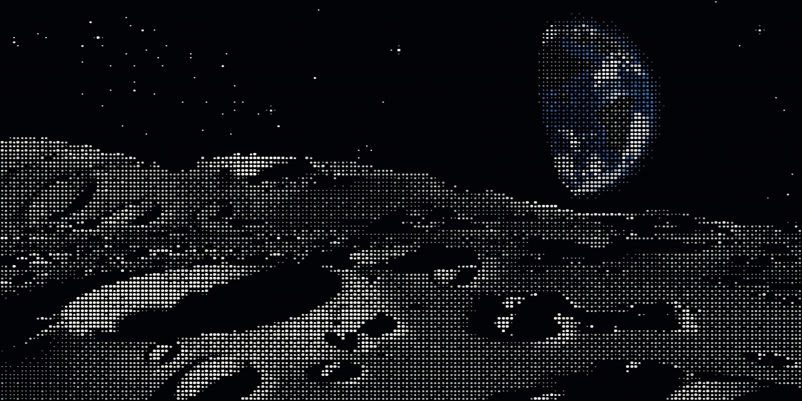

<!-- Banner: the "earthrise" piece from ascii.rest (MIT, @bas3line) — see assets/banner/NOTICE.md.
     To use the original renderer in assets/earthrise/ instead, swap the two paths below
     for assets/earthrise/earthrise.gif. -->

## Hey there 👋

I'm Shenton (Shentao) Yan — a postgraduate student in Low-Altitude Economics at The Hong Kong Polytechnic University, after an undergraduate degree in Supply Chain Management at Shenzhen University.

I work on operations research and mechanism design, and I keep wandering into blockchain standards and multi-agent AI. I write in both 中文 and English.

### 🔭 Currently working on

- **[sealed-bid-award-erc](https://github.com/shentonyan/sealed-bid-award-erc)** — a draft Ethereum standard for a sealed-bid award mechanism in agent task tenders.
- **[autoscientists](https://github.com/shentonyan/autoscientists)** — an automated research loop that takes a research idea through to a pull request.
- **[pol2-sycophancy-experiment](https://github.com/shentonyan/pol2-sycophancy-experiment)** — a third-party condition test for sycophancy in language models.
- **[dao-governance-replication](https://github.com/shentonyan/dao-governance-replication)** — an independent replication of a published study on DAO-based deliberation and voting for AI governance.

### 🧪 Research threads

- Low-altitude logistics: network design, congestion at landing points, and resilience in megacity drone delivery.
- Auction and market design for construction and demolition waste trading in Shenzhen, including a differentiable mechanism-design benchmark.
- Multi-agent AI and its governance — I've been reading the Ethereum standards for agent memory, including ERC-8350.
- Community co-governance with [NaturalDAO](https://github.com/naturaldao/NaturalDAO), where I contribute to the PoL2 documents.
- Learning Lean 4, slowly, in [lean_practice_0916](https://github.com/shentonyan/lean_practice_0916).

### 🗂️ Also here

| Repository | What it is |
| --- | --- |
| [pol2-governance-compiler](https://github.com/shentonyan/pol2-governance-compiler) | Turns PoL2 governance documents into checkable rules |
| [pol2-jev-honesty](https://github.com/shentonyan/pol2-jev-honesty) | Honesty probes for typed-decision models |
| [pol2-laya-studio](https://github.com/shentonyan/pol2-laya-studio) | A workbench for the PoL2 experiments |
| [love-arena-v2](https://github.com/shentonyan/love-arena-v2) | A multi-agent arena built on the PoL2 framing |
| [continuous-curvature](https://github.com/shentonyan/continuous-curvature) | Continuous-curvature path construction |

Older coursework, experiments, and forks are in the [repository list](https://github.com/shentonyan?tab=repositories).

### 📊 GitHub

### 🌐 Elsewhere

- Homepage: [shentonyan.github.io](https://shentonyan.github.io)

---

Banner: <b>earthrise</b> from <a href="https://ascii.rest/earthrise/">ascii.rest</a> by <a href="https://github.com/bas3line">@bas3line</a>, MIT licensed — notice in <a href="assets/banner/NOTICE.md">assets/banner</a>. An independent ASCII earthrise renderer of my own lives in <a href="assets/earthrise/">assets/earthrise</a>.
