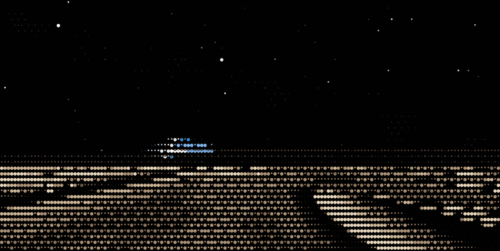

# earthrise

An ASCII animation of the Earth rising over a lunar horizon, drawn with four
halftone dot characters (` `, `·`, `•`, `●`) on a small colour palette.



Everything is generated procedurally and deterministically:

- the lunar surface is a fractal height field with craters and boulders, lit by
  a low sun, with shadows cast by marching rays toward it;
- the Earth is a shaded sphere with procedural continents, drifting cloud decks,
  polar ice, a specular glint on the ocean and a blue atmospheric limb;
- the sky has a faint galaxy band and a few stars that twinkle.

The loop is seamless: every time-varying quantity is a function of `sin`/`cos`
of `2πt` over a normalised phase `t ∈ [0,1)`, so the last frame runs back into
the first.

## Files

| File | What it is |
| --- | --- |
| `earthrise.js` | The renderer. No dependencies; draws into a 2D canvas. |
| `index.html` | A standalone page that plays the animation live. |
| `render.mjs` | Captures the frames in headless Chromium and builds the GIF. |
| `earthrise.gif` | The result, 1050×528, 96 frames at 14 fps. |

## Viewing it

Open `index.html` in a browser. It holds the first frame if the viewer has
`prefers-reduced-motion` set, or if you append `?static` to the URL.

## Re-rendering the GIF

Needs Node, Playwright and `ffmpeg` on `PATH`:

```sh
npm install playwright
node render.mjs
```

The GIF is built in two passes — one global palette for the whole loop, then
Bayer dithering onto it, which keeps the dot characters crisp instead of
smearing them the way error diffusion does.

## Credit

This is an original implementation; no code or artwork from any other project
is used here. The idea of a halftone-dot ASCII earthrise came from the animated
ASCII gallery at [ascii.rest](https://ascii.rest/earthrise/) by @bas3line, which
is worth a look in its own right — it animates live in the browser, which a
GitHub README cannot do.

MIT licensed.
